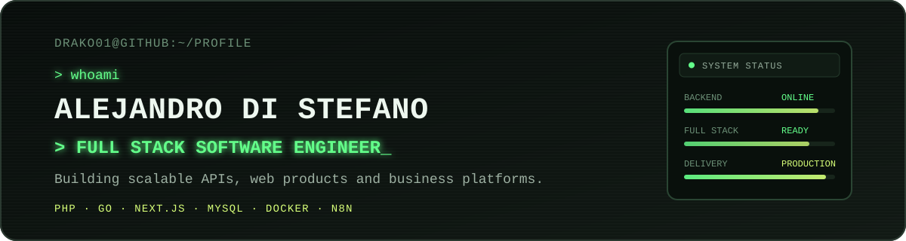
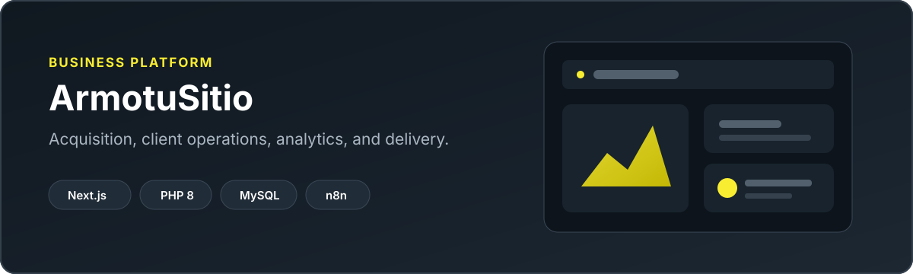
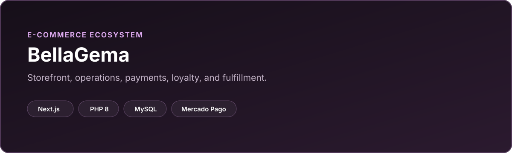
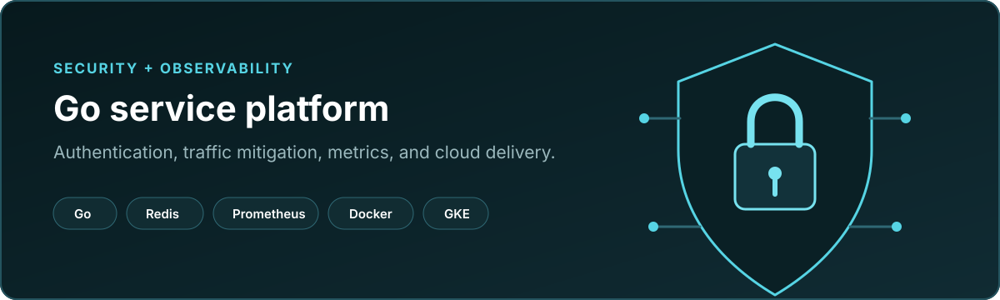
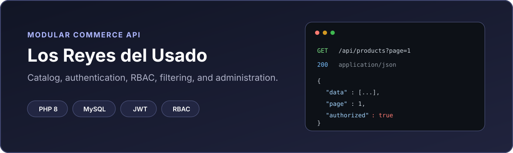

  

  <a href="https://distefano-alejandro.vercel.app/">Portfolio</a> ·
  <a href="https://armotusitio.com.ar/">ArmotuSitio</a> ·
  <a href="https://www.linkedin.com/in/alejandro-daniel-di-stefano/">LinkedIn</a>

## About me

I am a backend-focused Full Stack Software Engineer based in Argentina. I build complete web products:
from API design, authentication, data models, and business workflows to the interfaces and delivery pipelines
that make them useful in production.

My work sits at the intersection of **PHP and Go backends**, **React and Next.js applications**, and the
operational concerns behind real businesses: payments, permissions, automation, observability, email,
reporting, and reliable deployments.

I favor clear service boundaries, incremental delivery, and systems that remain understandable when the
product, team, and data grow.

## Professional focus

- Backend architecture, REST APIs, authentication, RBAC, and business-critical workflows.
- Full stack products, SaaS platforms, e-commerce, backoffices, and internal tools.
- Business automation with webhooks, cron jobs, n8n, queues, and third-party integrations.
- CI/CD, Docker-based delivery, cloud infrastructure, observability, and production support.
- Technical leadership through code reviews, mentoring, documentation, and developer education.

## Core stack

| Area | Technologies |
| --- | --- |
| **Backend** |     |
| **Frontend** |     |
| **Data** |     |
| **DevOps** |     |
| **Tools** |     |

## Selected projects

### ArmotuSitio — business platform and delivery studio

A multilingual product and operations platform that connects lead acquisition, dynamic project briefs,
client workflows, analytics, scheduling, and a secure backoffice.

- **Product scope:** marketing site, CRM workflows, client portal, budgets, agenda, analytics, and email.
- **Engineering:** modular PHP API, service and repository layers, RBAC, 2FA, audit trails, queues, and i18n.
- **Stack:** Next.js, React, TypeScript, PHP 8, MySQL, SMTP, n8n, and GitHub Actions.

[Visit ArmotuSitio](https://armotusitio.com.ar/)

### BellaGema — production e-commerce ecosystem

An end-to-end commerce platform for a real retail brand, covering the customer storefront, operations,
payments, fulfillment, loyalty, and post-sale communication.

- **Product scope:** catalog, cart, orders, customer accounts, promotions, loyalty, and admin dashboards.
- **Integrations:** Mercado Pago, payment webhooks, shipping flows, SMTP, and IMAP email operations.
- **Stack:** Next.js, React, PHP 8, MySQL, Mercado Pago, and GitHub Actions.

[Visit BellaGema](https://bellagema.com.ar/)

### Authentication and traffic security platform

A Go service architecture for authentication and high-volume traffic protection, designed around explicit
security controls, multiple persistence strategies, and production observability.

- **Backend:** JWT authentication, role-based access, concurrency controls, detection, and mitigation.
- **Operations:** structured logs, Prometheus metrics, Redis-backed coordination, and containerized delivery.
- **Stack:** Go, PostgreSQL, MongoDB, Firestore, Redis, Docker, Terraform, GKE, and Prometheus.

[View my engineering portfolio](https://distefano-alejandro.vercel.app/)

### Los Reyes del Usado — modular commerce API

A public PHP REST API that demonstrates layered backend design for a product catalog and administration
system, including authentication, authorization, filtering, and database-focused delivery.

- **Architecture:** routers, controllers, services, repositories, middleware, and explicit response helpers.
- **Capabilities:** JWT authentication, RBAC, product and category management, search, filters, and pagination.
- **Stack:** PHP 8, MySQL, PDO, JWT, Apache/Nginx, and Composer.

[Visit Los Reyes del Usado](https://losreyesdelusado.com.ar)

## Experience

| Period | Role and impact |
| --- | --- |
| **2026 — present** | **Full Stack Software Engineer, DIGI** — development and maintenance of SaaS products for financial and retail clients, working across Node.js and React applications, microservices, MongoDB, AWS-based services, authentication flows, onboarding processes, and production support. |
| **2019 — present** | **Founder and Product Engineer, ArmotuSitio** — end-to-end web products, e-commerce, backoffices, automation, performance, and client delivery. |
| **2022 — present** | **Technical Instructor, Coderhouse** — web and backend education, mentoring, code review, and practical engineering standards. |
| **2024 — 2025** | **Backend and Cloud Lead, Zelcar Games** — Go and PHP services, GKE, Redis, PostgreSQL, CI/CD, observability, and technical leadership. |

## Engineering principles

| Principle | What it means in practice |
| --- | --- |
| **Production first** | Failure paths, permissions, data integrity, logging, and deployment are part of the feature. |
| **Clear boundaries** | Controllers stay thin; services own business rules; repositories own persistence. |
| **Incremental delivery** | Small, backward-compatible changes are easier to verify, release, and operate. |
| **Product thinking** | Architecture decisions connect to the customer, operator, and business outcome. |

## GitHub activity

  

  
  

## Let's build something reliable

I am open to senior engineering, backend, full stack, technical leadership, and product consulting work.

  
  

